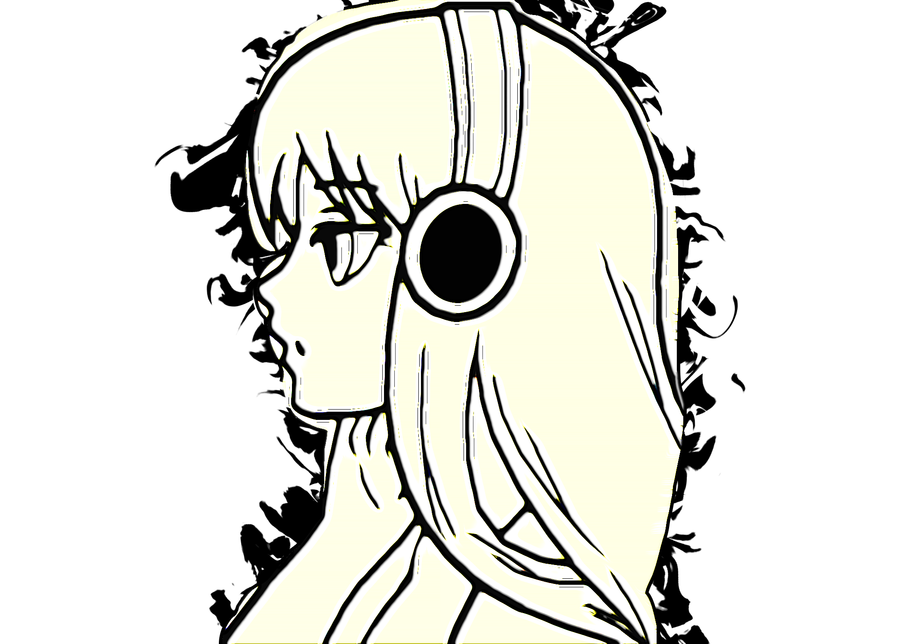
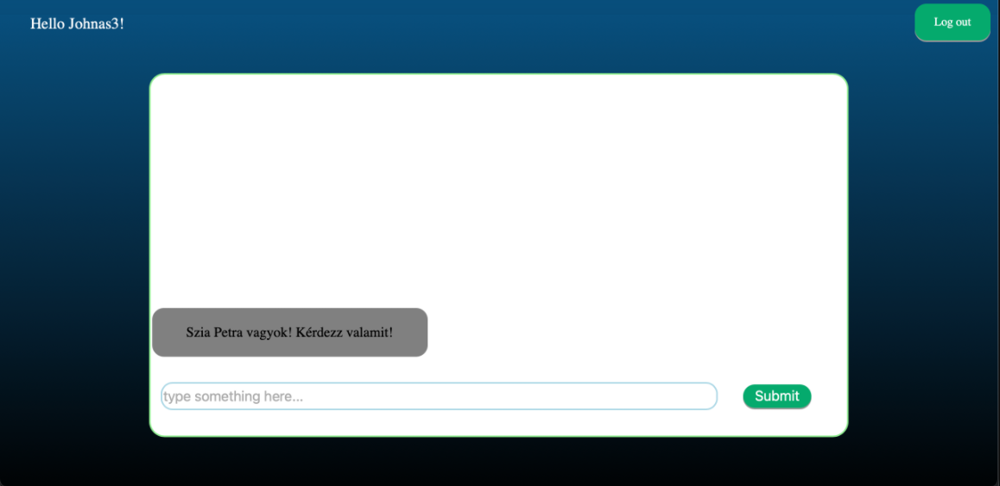

<!-- PROJECT LOGO -->
 

  

<h3 align="center">StillInBeta-Chatbot-AI</h3>

  

    A Multifunctional chatbot with sometimes rational responses  
    <a href="https://github.com/oneomo/StillInBeta-Chatbot-AI/issues">Request Feature | Report a Bug</a>
  

<!-- TABLE OF CONTENTS -->

  
Table of Contents

  <ol>
    <li>
      <a href="#about-the-project">About The Project</a>
      <ul>
        <li></li>
        <li><a href="#built-with">Built With</a></li>
        <li><a href="#built-with">Django</a></li>
        <li><a href="#built-with">Python</a></li>
        <li><a href="#built-with">Javascript</a></li>
        <li><a href="#built-with">HTML,CSS</a></li>
      </ul>
    </li>
    <li>
      <a href="#getting-started">Getting Started</a>
      <ul>
        <li><a href="#prerequisites">Prerequisites</a></li>
        <li><a href="#installation">Installation</a></li>
      </ul>
    </li>
    <li><a href="#usage">Usage</a></li>    
    <li><a href="#contact">Contact</a></li>
  </ol>

<!-- ABOUT THE PROJECT -->
## About The Project

### Built With

* [HTML](https://html.spec.whatwg.org/multipage/)
* [CSS](https://hu.wikipedia.org/wiki/Cascading_Style_Sheets)
* [JavaScript](https://www.javascript.com/)
* [Python](https://www.python.org/)
* [NLTK](https://www.nltk.org/)
* [PyTorch](https://pytorch.org/)
* [Django](https://www.djangoproject.com/)
* [JQuery](https://jquery.com)

(<a href="#top">back to top</a>)

<!-- GETTING STARTED -->
## Getting Started
To get a local copy up and running follow these simple example steps.

### Prerequisites
-Python 3.7.9 
-Django library 
-Pytorch library 
-NLTK library 
### Installation
-Install python and the libraries mentioned in prerequisites with the usage of pip. 
-Fork the project 

 

(<a href="#top">back to top</a>)

<!-- USAGE EXAMPLES -->
## Usage
-Go into the main folder then type: python manage.py runserver 
-Open a web browser and go to 127.0.0.1/register url to registrate then you can log in with your given credentials and then you can use the application. 
-You type something and our chatbot tries to give a logical response, right now it is not that developed, but she can give some responses.
 

(<a href="#top">back to top</a>)

<!-- CONTACT -->
## Contact

Your Name - [@SChatbotai](https://twitter.com/SChatbotai) - StillInBeta.ChatbotAI@protonmail.com

Project Link: [https://github.com/oneomo/StillInBeta-Chatbot-AI](https://github.com/oneomo/StillInBeta-Chatbot-AI)

(<a href="#top">back to top</a>)

<!-- MARKDOWN LINKS & IMAGES -->
<!-- https://www.markdownguide.org/basic-syntax/#reference-style-links -->
[contributors-shield]: https://img.shields.io/github/contributors/github_username/repo_name.svg?style=for-the-badge
[contributors-url]: https://github.com/github_username/repo_name/graphs/contributors
[forks-shield]: https://img.shields.io/github/forks/github_username/repo_name.svg?style=for-the-badge
[forks-url]: https://github.com/github_username/repo_name/network/members
[stars-shield]: https://img.shields.io/github/stars/github_username/repo_name.svg?style=for-the-badge
[stars-url]: https://github.com/github_username/repo_name/stargazers
[issues-shield]: https://img.shields.io/github/issues/github_username/repo_name.svg?style=for-the-badge
[issues-url]: https://github.com/github_username/repo_name/issues
[license-shield]: https://img.shields.io/github/license/github_username/repo_name.svg?style=for-the-badge
[license-url]: https://github.com/github_username/repo_name/blob/master/LICENSE.txt
[linkedin-shield]: https://img.shields.io/badge/-LinkedIn-black.svg?style=for-the-badge&logo=linkedin&colorB=555
[linkedin-url]: https://linkedin.com/in/linkedin_username
[product-screenshot]: images/screenshot.png
